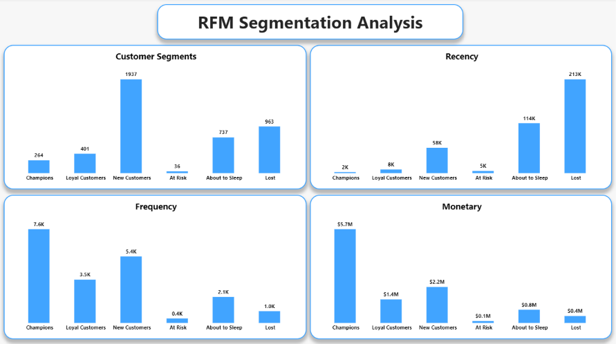

<h1 align="center">RFM Segmentation & Cohort Retention Analysis</h1>

## Background and Overview

This project analyzes the UCI "Online Retail" dataset — roughly 540,000 invoice line items from a UK-based online retailer between December 2010 and December 2011 — to understand who the retailer's customers are and how well the business retains them over time. It combines two complementary techniques: RFM (Recency, Frequency, Monetary) segmentation to classify customers by value and engagement, and cohort retention analysis to track how purchasing behavior fades or persists month over month after a customer's first purchase.

The analysis was built in DuckDB (SQL, file `uci_rfm_analysis.sql`) and visualized across two pages in Power BI.

## Data Structure Overview

| Category | Fields | Description |
|---|---|---|
| Transaction identifiers | `InvoiceNo`, `StockCode`, `CustomerID` | Identify each invoice line, product, and customer |
| Transaction detail | `Description`, `Quantity`, `UnitPrice`, `InvoiceDate`, `Country` | What was bought, how much, at what price, and when |
| RFM outputs (`customer_rfm`, `rfm_scores`, `rfm_segments`) | `recency_days`, `frequency`, `monetary`, `r_score`, `f_score`, `m_score`, `segment` | Per-customer recency/frequency/monetary values, their quintile scores, and the named segment derived from those scores |
| Cohort outputs (`customer_cohorts`, `cohort_activity`, `cohort_sizes`, retention view) | `cohort_month`, `month_number`, `active_customers`, `cohort_size`, `retention_pct` | Each customer's first-purchase month (their cohort), how many months since, and what share of the original cohort was still active that month |

The raw `Online Retail.csv` was loaded into a `uci_flat_table` view, then filtered to `clean_invoices` (positive quantity and price, non-null CustomerID) as the base for both analyses. RFM used a fixed reference date of 2011-12-09 (the day after the dataset's last invoice); recency and monetary were scored by quintile (`NTILE(5)`), while frequency was scored with fixed bins due to its skew. Cohort analysis grouped customers by their first purchase month and measured retention as active customers in a given month divided by the original cohort size.

## Executive Summary

The customer base of 4,339 people splits unevenly by value: **Champions (265 customers) generate $5.7M**, more than all other segments combined, while **New Customers (1,937, the largest group) contribute $2.2M** and **Lost customers (963) represent $0.4M** in historical spend now gone cold. Retention drops off a cliff after a customer's first month — every cohort falls from 100% to roughly 15–35% by month 1 — but among customers who stick around past that point, retention stabilizes in the 20–30% range for several months rather than continuing to erode, suggesting a distinct "core repeat" customer base once the one-time buyers are filtered out.

## Insights Deep Dive

**Segment sizes and value**
New Customers is the largest segment (1,937 customers, 44.6% of the base) but a mid-tier value contributor ($2.2M). Champions is a much smaller group (265 customers, 6.1%) yet generates the most revenue by far ($5.7M) — over 2.5x New Customers' total despite roughly an eighth of the headcount. Loyal Customers (401) contribute $1.4M. At Risk is the smallest segment by far (36 customers, $0.1M), while About to Sleep (737, $0.8M) and Lost (963, $0.4M) together account for over 1,700 customers whose engagement has faded.

**Recency by segment**
Champions and Loyal Customers show tight, low recency (2K–8K cumulative days across the segment), confirming they've purchased very recently. Lost customers show the highest cumulative recency (213K), consistent with having not purchased in a long time — the segmentation logic is behaving as designed.

**Cohort retention pattern**
Every cohort, regardless of start month, loses 65–85% of its customers by the second month. The December 2010 cohort — the largest and longest-observed (885 customers) — is the clearest read: it settles into a retention band of roughly 33–50% from month 1 onward, even ticking up in later months, which points to real repeat-purchase behavior among the customers who don't churn immediately rather than a one-time holiday-shopping spike.

**Data coverage tapers by cohort**
Later cohorts (mid-to-late 2011) have progressively fewer months of observed retention simply because the dataset ends in December 2011 — a newer cohort hasn't had time to accumulate 12 months of data, so its retention curve is naturally shorter, not necessarily worse.

## Recommendations

Protect and grow the Champions segment first — it's a small group driving the majority of revenue, so even modest churn there has an outsized financial impact; consider a loyalty or VIP program targeted specifically at this group. Treat the first-month drop-off as the single highest-leverage moment for retention efforts: a welcome or second-purchase incentive campaign timed to a customer's first 30 days could meaningfully change the shape of every future cohort curve. New Customers, while numerically large, should be evaluated for how many convert into Loyal Customers or Champions over time rather than treated as already valuable — a follow-up analysis tracking segment migration month over month would clarify this. About to Sleep and At Risk together are a natural target for win-back campaigns, since they're closer to reactivation than the Lost segment.

## Caveats and Assumptions

RFM segment boundaries were defined using fixed score-combination rules rather than a data-driven clustering method, so segment sizes reflect those thresholds rather than natural breaks in the data. The dataset spans only 13 months, so cohorts from later in the window have too little observed history to judge their long-term retention fairly. `CustomerID` is missing for a portion of the original transaction data (excluded during cleaning), meaning both analyses only reflect identifiable customers, not all transactions. Country-level and product-level effects were not explored here, so segment and retention patterns may vary meaningfully by market or product line. Finally, "monetary" reflects historical spend as recorded in this dataset and is not adjusted for returns beyond the basic quantity/price filtering applied during cleaning.